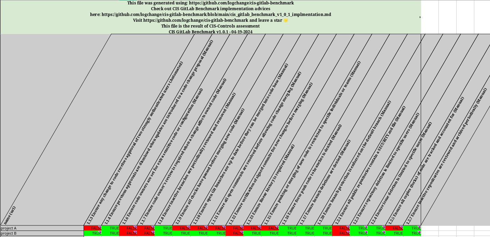

# cis-gitlab-benchmark
Automation for CIS GitLab Benchmark

```bash
python -m venv ./venv
source ./venv/bin/activate
which python
pip3 install -r requirements.txt
```

Running locally requires setting up following environment variables:

```
GITLAB_TOKEN=
GITLAB_URL=
```

Running:

```bash
python __main__.py <gitlab_group_name> <config_file.yml>
```

You can use `default-config.yml` or adjust it to your needs.

#### Output

